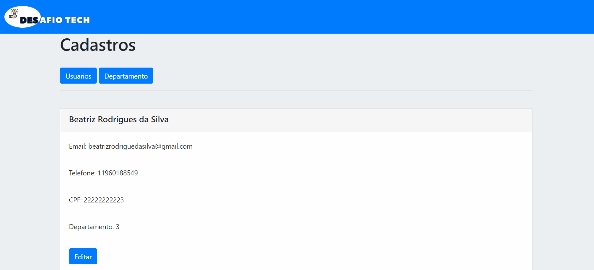
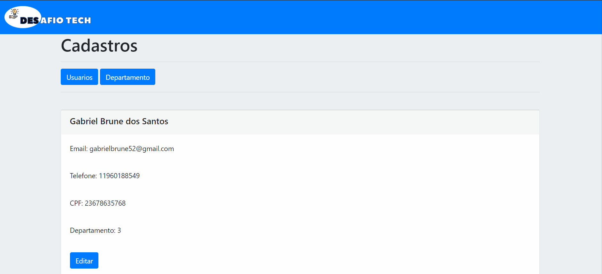

<h1 align="center">
    
</h1>
<p align="center"> 
  O “Desafio Tech” é um sistema de cadastro, onde o funcionario cadastrado é ligado a um departamento, os dados exigidos do usuario são nome, telefone, email, cpf e propriamente o departamento. Após o cadastro a plataforma irá mandar uma mensagem ao email do funcionario.
</p>
 <h2>:computer: Aplicação Web</h2>
 <h3>Home</h3>
<hr>
 
 <hr>
<h3> Editar</h3>
 
<hr>
<h2> :bulb: Funcionalidades</h2>

* Criar Usuários;

* Listar Cadastros;

* Criar Departamentos.

* Encaminhar email.
<h2> :wrench: Pré-requisitos</h2>

 Antes de começar, você vai precisar ter instalado em sua máquina as seguintes ferramentas:
[Git](https://git-scm.com), [Node.js](https://nodejs.org/en/). Além disto é bom ter um editor para trabalhar com o código como o [VSCode](https://code.visualstudio.com/)

:rocket: Para rodar a aplicação

  ```bash

# Clone este repositório
$ git clone https://github.com/Gabriel52/challenge-tech

# Acesse a pasta do projeto no seu terminal/cmd
$ cd CRUD(DESAFIO)

# Execute o comando na pasta CRUD(DESAFIO) para instalar todas as dependências
$ npm install ou yarn

# Execute a aplicação em modo de desenvolvimento, é importante executar este
$ nodemon index.js

# A aplicação web será aberta na porta:8080 - acesse http://localhost:8080

 ```

## 🛠 Tecnologias
Node.js (Back-End);

HTML + Bootstrap 4 (Web Front-End);

MySQL (Banco de Dados);

<h2> :book: Licença </h2>
<p>Lançado em 2020 :book:</p></br>
<p>Feito por Gabriel Brune :rocket:. Este projeto está sobre a licença do MIT</p></br>
<p>Dar uma :star: se este projeto te ajudou</p>

<h2> 🐛 Problemas</h2
<p>Sinta-se à vontade para registrar um novo problema com o respectivo título e descrição no repositório Proffy . Se você já encontrou uma solução para seu problema, eu adoraria revisar sua solicitação de pull !</p>


